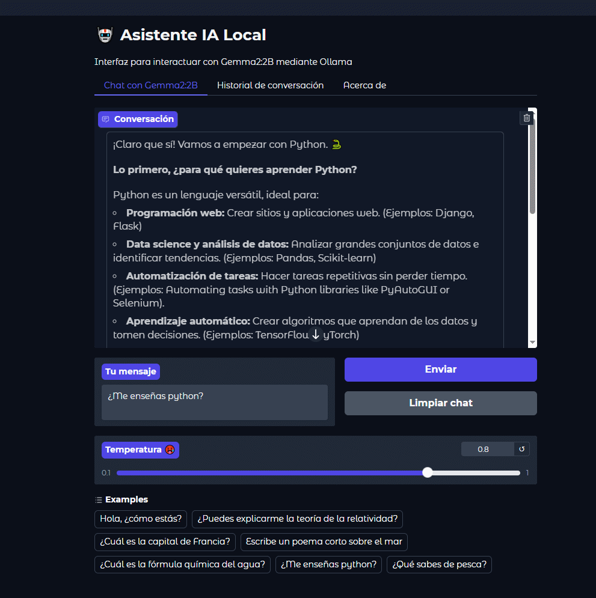

## 🤖 Asistente IA Local 🤖

Interfaz web para interactuar con modelos de lenguaje a través de Ollama, construida con Gradio.

## Características

- Interfaz web amigable con Gradio
- Historial de conversaciones persistente en SQLite
- Soporte para diferentes modelos de Ollama
- Ajuste de parámetros como temperatura
- Visualización del historial de conversaciones

## 🤖 Acerca de este Asistente

Este es un asistente de IA local construido con:

- **Gradio**: Para la interfaz web
- **Ollama**: Para ejecutar modelos localmente
- **Gemma2:2B**: Modelo de lenguaje de Google

## 🚀 Instalación y Uso
0. Clona el repositorio: git clone https://github.com/charran78/asistente-ia-local.git
1. Instala Ollama desde [ollama.com](https://ollama.com/)
2. Descarga el modelo: `ollama pull gemma2:2b`
3. Crea el entorno virtual. '.\mi_entorno\Scripts\activate'
4. Instala las dependencias.
5. Ejecuta este script: `python grad_ia.py`

## 📦 Dependencias

Instala las dependencias con:
         
pip install -r requirements.txt
            
## Demo

## 📝 Licencia

Este proyecto está bajo la Licencia MIT.

## 👨‍💻 Autor

Pedro Mencías - 2025

## 📧 Contacto

[beyond.digital.web@gmail.com](mailto:beyond.digital.web@gmail.com)

Hecho en Asturias con 💓 y {miles de errores}

